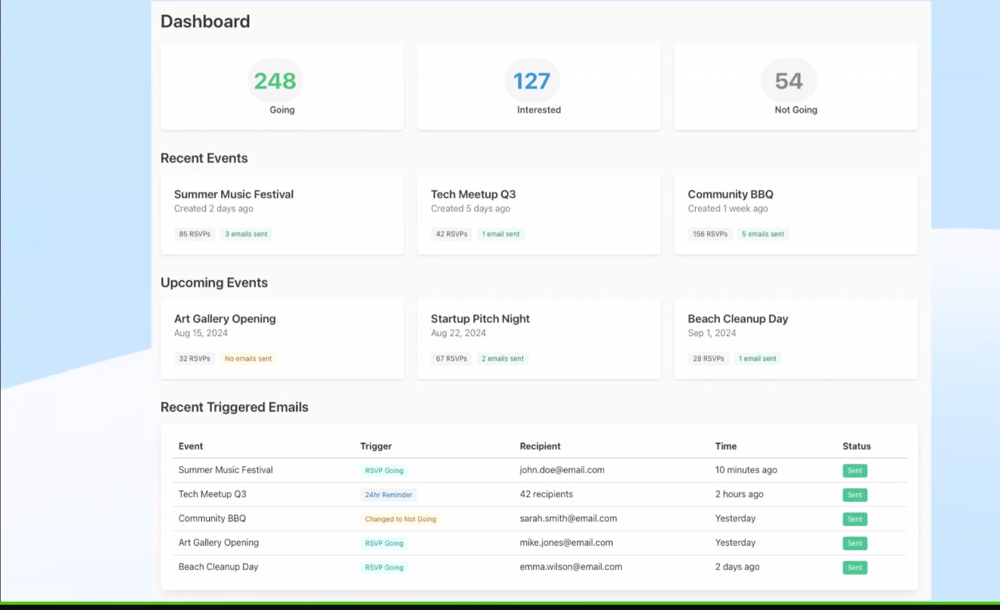

- [ATProtocol Dev Talks: Smoke Signal Turns one](https://smokesignal.events/did:plc:lehcqqkwzcwvjvw66uthu5oq/3ltwkusl2wq2m?ref=atprotocol.dev)
	- retrospective on SS
		- lots of people contributed D: couldn't write down everyone
		- 
		- 
			- lots of stuff such as auth has been moved from app into [rust crates](https://crates.io/users/ngerakines?sort=downloads)
		- local dev setup?
			- https://tangled.sh/@smokesignal.events/localdev
		- what is postgres for?
			- deduplicating the local copies of repos from pdses (cache)
			- sharing schemas across apps
		- what have we learned in a year?
		  collapsed:: true
			- rust was a good call
			- no official libraries. started using atrium, but it didn't make it easy to create and work with custom lexicons. so rolled my own client
			- oauth isn't that hard
				- considered starting a tutoring service for auth impl lol
				- just need to understand resource server, protected server, dynamic client registration, dpop, parametrized request etc
				- no. 1 question about atp dev is oauth. commonly missed points:
					- dpop
					- "why can't i make this request from frontend"
					- oauth and id registration are linked
				- oauth client metadata is supposed to predeclare scopes, but there might be so many scopes it won't fit into a record. worried there might be a lot of wildcards
			- bulma and picocss are fine. nick is not a frontend guy apparently
			- really glad that i bother people about design decisions
				- like what should a field be named in a record
			- ai is a 10x enabling force
				- end of last year was rough, end of spring was rough (something like writer's block). ai is especially well suited for rust, rust is strict, and errors are very detailed.
					- Text lookups/ast lookups in ide are rly good
				- does ai create licensing issues?
					- there needs to be a wide debate about IP and credit. My blanket solution is to be open abt using ai, and license permissively (mit)
					- IP-related code search is a racket
			-
		- Smoke Signal as infrastructure
			- there needs to be some baseline for applications that work with events to build more complicated apps such as a meetup.com equivalent
			- need to figure out what xrpc procedures should be in ss vs in lexicon.community #followup
		- Bringing atmospthere to the web
			- dislike closed ecosystem of web apps such as meetup
			- data needs to be open and easy to work with.
				- widgets, rss feeds
					- 
		- event organizer tools
			- [xrpc webhooks](https://bsky.app/profile/smokesignal.events/post/3lugrsnmsyk2e)
				- https://blog.smokesignal.events/posts/3luduqmekg52a-xrpc-webhooks-protocol-adjacent-event-streams
				- invoker says what they're providing
				- same broad pattern as subscribing to a feedgen record, it also serves personalized data
				- strongly typed and openly defined webhooks
				- create xprc procedures based on those hooks
			- 
		- ephemeral records?? i didn't catch this
			- for private data
			- organizer links into a 3p service like for sending out zoom links
		- decentralized multi service profile?
			- aip exists in oidc world. how to represent the decentralized (across apps) to oidc. CSS/inheritance for profile fields D:
		- locations. skyler/ms boba have been working on it
		- feeds (of events)
			- i want to be a lazy as possible
			- feeds should support a broad list of record types
			- should be used to generate calendars
			- personal note: excited about graze.social, including for prospects of non-post feeds
		- rsvp signing
			- confirmations/attestation for RSVPs
		- moderation
			- so far have avoiding moderation. only one spammer so far
			- subscribed to jetstream so events are accepted from anywhere, but only indexed on the app if the user has signed in to smokesignal.
				- so if someone never logs in, their events are not indexed
				- can also used for reactive moderation (banned accounts not indexed either)
		- AI
			- have a working MCP server, i can ask claude to make an even with certain fields
				- claude knows enough to sign in with AIP and invoke the needed xrpc methods
			- potential discussion for authorship/attribution
		- interest profiles (event categories)
			- how do i convey my location-related interests in a safe way?
				- need to figure this out #followup
			- also cultural/thematic categories.
		- Acudo
			- single-event webpage. lets organizer showcase 1 event and let people rsvp, buy tickets etc
				- 
			- when you purchase ticket, app receives webhook back and can create the rsvp record on your behalf, or create signed badges
				- comments suggested https://ti.to/ as good ticketing platform
			- also a way to aggregate these attestations
		- service2service
			- event resolution/discovery/search can happen without the user touching smokesignal. just an api??
			- want a variety of apps using the event/rsvp lexicons
				- could be not just a meetup but also a corporate event etc. like an appointment with a hair salon idk
		- monetization strategy?
			- base app is discovery/engagement
			- needs to be hooked up to mailer service. could be a premium service
			- need to respect core value of ownership of identity/ mobility of data
		- we have a [discourse forum](https://discourse.smokesignal.events/) with both oidc and atproto oauth
			- discussions on localization and scope
			- announcements
		- donate link: fuck u give me $5 https://opencollective.com/atprotocoldev/projects/smoke-signal
			- maybe worth paying people for time on educating people.
		- also give money to blacksky
		- questions?
			- for event publication, people sometimes want rsvps to be private?
				- have a plan for urself or waiting for upstream? mls/e2ee or atproto private data
				- a: there's private blobs or private records
					- nick:
						- probably private records will be on a separate private pds
						- i don't love the idea of having to encrypt records. it's messy
						- no idea what upstream will do
					- boris:
						- there has been no public work on private data. lots of interest, lots of waiting on upstream bsky team
						- there's an rfc around private data https://github.com/knasher/rfcs/blob/main/atproto/001-private-content.md
							- if you have serious skills around cryptography and distributed systems, contact boris privately, he has a group
								- but pretty high bar
								- lots of ambient pressure people who don't care and want it done yesterday. trying to keep noise out
				- more on ticketing?
					- want to fuck up ticketmaster
						- seed used to validate timing (like fido)
						- seed for time based qr code gen in mobile app
						- wants to pull up a phone with an attested copy of rsvp, signer verifies identity and compares to existing record
						- some ppl (stel) have done stuff with wallet linking
					- good usecase for ss as infra (like with emailer)
						- needs to be adapted for different usecases like meetup.com vs luma
							- #TODO this needs to be elaborated on
						- ghost newsletter should be linked to events. hard to code but should be linked to events
							- possibly a monetizable service. but the core is always owned and portable data.
				- boris is working with gander.social is a canadian bsky instance
					- smokesignal events for canada might be a good idea too. this would eat fb groups/events
				- off the record:
					- in grain.social, follows are bsky follows?
					- plans for lexicon community conf in january
					- aip:
						- if you have a cluster of apps with an aip instance, it could use account labels for auth/scopes and moderation
					- if you want to build something on top of ss, go to the forum. there's grants